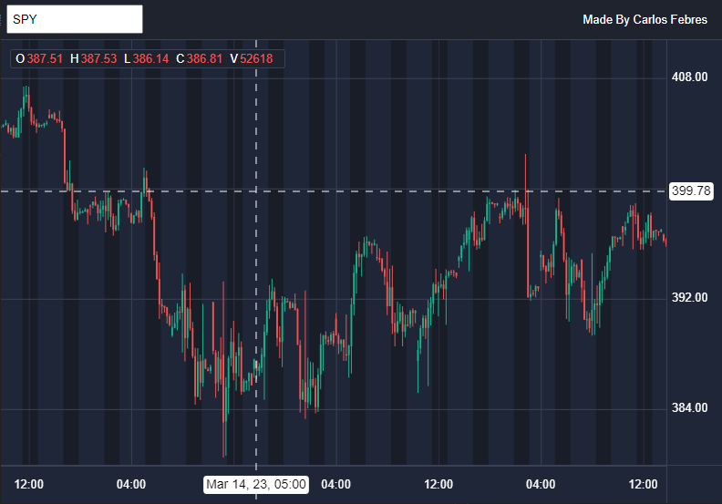

# CF Chart Lite
### A Stock Charting Library

CF Chart is a charting library inspired by TradingView

### Link
https://cf-chart-lite.netlify.app/

## Features

- **Interactive Charting**: Dynamically zoom, pan, and scale charts to view stock data at various resolutions from years down to minutes.

- **Double tap and drag zoom**: quickly double-tap but hold your finger down on the second tap. Then, slide your finger down to zoom in or up to zoom out.

- **Pinch zoom**: Pinch with two fingers to zoom.

- **Drag on X axis bar to zoom**: Drag a finger horizontaly to zoom on the chart.

- **Responsive Design**: Optimized for both desktop and mobile devices, ensuring your charts look great on any screen size.

## Author
**Carlos Febres**

## License
N/A

